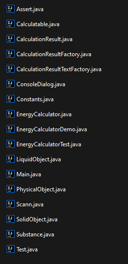
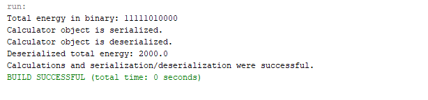
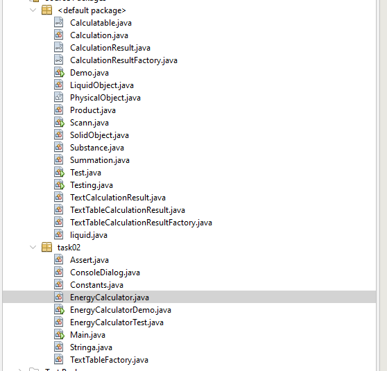

# 34_makarenko_artem

+ [TASK01](#TASK01)
+ [TASK02](#TASK02)
+ [TASK03](#TASK03)
+ [TASK04](#TASK04)

## TASK01:
**Завдання:**

Выполнить разработку простейшей консольной программы на Java,
например, выводящей на экран все аргументы командной строки, заданные
при запуске и разместить её в локальном хранилище.

# Результат запуску кода:

## TASK02:
Індивідуальне завдання:
Варінт 15 - Знайти двійкове уявлення цілісного значення повної енергії фізичного тіла при заданих значеннях маси, швидкості та висоти.

# Результат виконання програми:

**Виконання** **Main**:

**Виконання** **EnergyCalculatorDemo:**

## TASK03:
**Завдання:**
 1. Як основа використовувати вихідний текст проекту попередньої роботи.
Забезпечити розміщення результатів обчислень у колекції з можливістю
збереження/відновлення.
 2. Використовуючи шаблон проектування Factory Method (Virtual
Constructor), розробити ієрархію, що передбачає розширення за рахунок
додавання нових класів, що відображаються.
 3. Розширити ієрархію інтерфейсом об'єктів, що "фабрикуються", що
представляють набір методів для відображення результатів обчислень.
 4. Реалізувати ці методи виведення результатів у текстовому вигляді. Розробити
та реалізувати інтерфейс для "фабрикуючого" методу.
 5. Забезпечити діалоговий інтерфейс із користувачем.
 6. Розробити клас для тестування основної функціональності.
 # Результат виконання програми:
 
 
## TASK04:
**Завдання**
Як основа використовувати вихідний текст проекту попередньої роботи.
Використовуючи шаблон проектування Factory Method (Virtual Constructor),
розширити ієрархію похідними класами, які реалізують методи представлення
результатів як текстової таблиці. Параметри відображення таблиці повинні
визначатися користувачем.
Продемонструвати заміщення (перевизначення, overriding), поєднання
(перевантаження, overloading), динамічне призначення методів (пізнє
зв'язування, поліморфізм, dynamic method dispatch).
Забезпечити діалоговий інтерфейс із користувачем.
Розробити клас для тестування основної функціональності.
Використати коментарі для автоматичного створення документації
засобами javadoc.
 **Результат виконання програми:**

