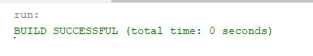
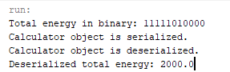
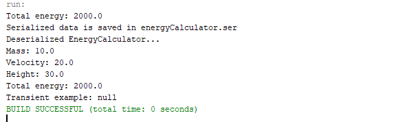

# 34_makarenko_artem

+ [TASK01](#TASK01)
+ [TASK02](#TASK02)

## TASK01:
Завдання:

Выполнить разработку простейшей консольной программы на Java,
например, выводящей на экран все аргументы командной строки, заданные
при запуске и разместить её в локальном хранилище.

# Результат запуску кода:

## TASK02:
Індивідуальне завдання:
Варінт 15 - Знайти двійкове уявлення цілісного значення повної енергії фізичного тіла при заданих значеннях маси, швидкості та висоти.

# Результат виконання програми:

**Виконання** **Main**:

**Виконання** **EnergyCalculatorDemo:**

